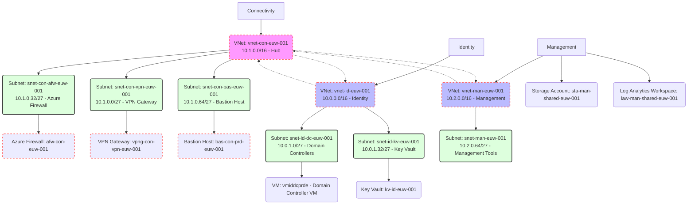

```mermaid
graph TD
    %% Nodes
    Connectivity
    Management
    Identity
    vnet_con_euw_001("VNet: vnet-con-euw-001\n10.1.0.0/16 - Hub")
    snet_con_bas_euw_001("Subnet: snet-con-bas-euw-001\n10.1.0.64/27 - Bastion Host")
    snet_con_vpn_euw_001("Subnet: snet-con-vpn-euw-001\n10.1.0.0/27 - VPN Gateway")
    snet_con_afw_euw_001("Subnet: snet-con-afw-euw-001\n10.1.0.32/27 - Azure Firewall")
    afw_con_euw_001("Azure Firewall: afw-con-euw-001")
    vpng_con_vpn_euw_001("VPN Gateway: vpng-con-vpn-euw-001")
    bas_con_prd_euw_001("Bastion Host: bas-con-prd-euw-001")
    vnet_id_euw_001("VNet: vnet-id-euw-001\n10.0.0.0/16 - Identity")
    snet_id_dc_euw_001("Subnet: snet-id-dc-euw-001\n10.0.1.0/27 - Domain Controllers")
    snet_id_kv_euw_001("Subnet: snet-id-kv-euw-001\n10.0.1.32/27 - Key Vault")
    vmiddcprde("VM: vmiddcprde - Domain Controller VM")
    kv_id_euw_001("Key Vault: kv-id-euw-001")
    vnet_man_euw_001("VNet: vnet-man-euw-001\n10.2.0.0/16 - Management")
    snet_man_euw_001("Subnet: snet-man-euw-001\n10.2.0.64/27 - Management Tools")
    sta_man_shared_euw_001("Storage Account: sta-man-shared-euw-001")
    law_man_shared_euw_001("Log Analytics Workspace: law-man-shared-euw-001")

    %% Connections
    Connectivity --> vnet_con_euw_001
    Management-->vnet_man_euw_001
    Identity-->vnet_id_euw_001
    vnet_con_euw_001 --> snet_con_bas_euw_001
    vnet_con_euw_001 --> snet_con_vpn_euw_001
    vnet_con_euw_001 --> snet_con_afw_euw_001
    snet_con_afw_euw_001 --> afw_con_euw_001
    snet_con_vpn_euw_001 --> vpng_con_vpn_euw_001
    snet_con_bas_euw_001 --> bas_con_prd_euw_001
    vnet_id_euw_001 --> snet_id_dc_euw_001
    vnet_id_euw_001 --> snet_id_kv_euw_001
    snet_id_dc_euw_001 --> vmiddcprde
    snet_id_kv_euw_001 --> kv_id_euw_001
    vnet_man_euw_001 --> snet_man_euw_001
    vnet_con_euw_001 -.-> vnet_id_euw_001
    vnet_con_euw_001 -.-> vnet_man_euw_001
    vnet_id_euw_001 -.-> vnet_con_euw_001
    vnet_man_euw_001 -.-> vnet_con_euw_001
    Management-->law_man_shared_euw_001
    Management-->sta_man_shared_euw_001
    %% Styling
    classDef hub fill:#f9f,stroke:#333,stroke-width:2px;
    classDef spoke fill:#bbf,stroke:#333,stroke-width:2px;
    classDef resource fill:#dfd,stroke:#333,stroke-width:2px;
    classDef peering stroke:#f66,stroke-width:2px,stroke-dasharray: 5, 5;
    
    class vnet_con_euw_001 hub;
    class vnet_id_euw_001,vnet_man_euw_001 spoke;
    class snet_con_bas_euw_001,snet_con_vpn_euw_001,snet_con_afw_euw_001,snet_id_dc_euw_001,snet_id_kv_euw_001,snet_man_euw_001 resource;
    class afw_con_euw_001,vpng_con_vpn_euw_001,bas_con_prd_euw_001,vnet_con_euw_001,vnet_id_euw_001,vnet_man_euw_001 peering;


```